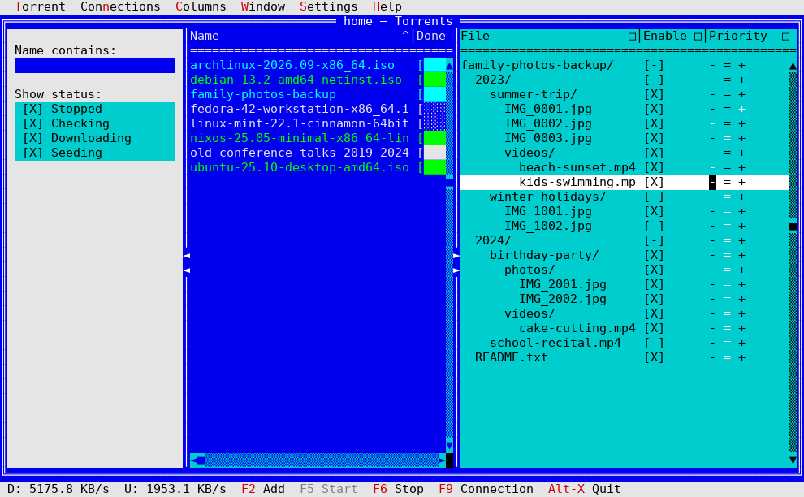

# TV Transmission


[](https://claude.ai/code)


**Version 1.7.7** — stable release.



A terminal UI (and CLI) client for Transmission (`transmission-daemon`),
built on [Turbo Vision (magiblot/tvision)](https://github.com/magiblot/tvision),
written in C++17.

It talks to `transmission-daemon` over its JSON RPC (HTTP, port 9091 by
default), so no native Transmission library is needed — just libcurl for
HTTP and nlohmann/json for parsing.

## Features

**Torrent list — one window per configured server**
- Every server named in the Connection dialog (see below) gets its own
  torrent-list window, all open at once, each always exactly filling
  the whole desktop (adjusting automatically if the terminal itself is
  resized) and stacked on top of each other rather than side by side —
  titled with that server's own logical name ("home — Torrents", say)
  so whichever one is on top is easy to identify. Deliberately NOT
  closable, movable, or resizable from the window itself (no close box,
  Alt+F3 does nothing, dragging or Ctrl+F5-zooming doesn't either) —
  every configured server is meant to always have its own window open,
  always at that one size; the only way to actually remove one is the
  Connection dialog's own "[-]" on that server's name (see below),
  which closes its window along with removing it (see CHANGELOG.md
  below for the two back-and-forth changes this went through — an
  ordinary resizable/tileable MDI window in between, briefly — before
  settling back on always-maximized for good reason)
- **Connections** (its own menu) lists every configured server by
  name, a bullet and the whole name highlighted for whichever one is
  currently on top — pick a different one to bring its own window
  forward instead, or check the menu at a glance to see which one
  that already is without needing to bring anything forward first. No
  servers configured yet shows a single, disabled "Empty" entry instead
- **Window → Tile/Cascade** only ever affects this app's own other
  window types (Torrent details, Files, Tracker) — every torrent-list
  window being always exactly the same size (the whole desktop) makes
  tiling or cascading them against each other meaningless; **Connections**
  above is what actually switches between them. **Window → Window
  list...** (Alt+0) still lists every open window of every kind
  together, including torrent-list ones, and still jumps straight to
  whichever is picked
- Every Torrent-menu action (Start, Stop, Queue, Select Multiple, Add,
  ...) acts on whichever torrent-list window currently has focus — the
  same "act on the focused one" rule "Manage columns..." already
  followed for whichever grid had focus, now covering every torrent
  action too, since there's more than one list to choose from
- Each window's own position and size is saved when the app closes and
  restored on the next launch (clamped to the current terminal size if
  it's shrunk since — see CHANGELOG.md), along with which one had
  focus, so that one comes back on top of the others
- Columns: name (bold), progress bar, size, download rate, upload
  rate, date added, status — shown by default; nine more are available
  but hidden by default (see "Manage columns..." below): ratio,
  all-time uploaded/downloaded totals, location, ETA, peers connected,
  queue position, bandwidth priority, and completion date
- Every column except the progress bar can be resized (drag the
  separator between two headers with the mouse) or reordered
  (double-click a column's name — "<"/">" markers appear where a move
  is possible); **Columns → Manage columns...** does the same, plus
  showing/hiding columns, all from one place — see its own entry below.
  Width, order, and visibility are each server's own — a window resized
  or reconfigured this way doesn't affect any other open one — and
  saved/restored per server across launches (see CHANGELOG.md for
  why this changed from a single shared layout)
- Click a column header to sort by it; click again to reverse the
  direction (a `^`/`v` indicator shows the active column and direction);
  the chosen column and direction — unlike width/order/visibility above,
  still one shared setting across every open window, not per server —
  are saved and restored on the next launch
- If enough columns are shown at once that they don't all fit — a wide
  terminal helps, but with several of the optional columns turned on
  it's easy to exceed even that — a horizontal scrollbar appears below
  the list to reach the rest, keeping the header lined up with whatever
  the rows have scrolled to. Hidden entirely (its row handed back to
  the list itself, one more visible row of torrents) whenever
  everything already fits, rather than always taking up a row for a
  control that would have nothing to do
- Progress bar fills up with block characters (`[████░░░░] 42%`) as the
  torrent approaches 100%, instead of a plain percentage number
- Text color reflects the torrent's status at a glance: cyan while
  downloading, green while seeding, gray while stopped, yellow while
  checking/queued, red if it has an error — all on the same blue
  background as before; the currently selected row stays black-on-white
  regardless of status, so it's always clear what's selected
- Double-click a row to open a details window for that torrent — window
  title includes the start of the torrent's name, so several open ones
  are distinguishable at a glance; these are ordinary, non-modal windows
  using tvision's default palette (same look as the Settings dialog), so
  you can have several open at once, and double-clicking a torrent that
  already has one open brings it to the front instead of opening a
  duplicate. Shows:
  - Name, size (with piece count/size), download location, public/
    private, magnet link (truncated — see "Known limitations" for why)
  - Completion %, availability % (see CHANGELOG.md for the
    formula), all-time downloaded/uploaded totals and ratio, current
    download/upload rate, average speed since first started
  - Added date, last activity date
  - Time spent downloading / time spent seeding
  - Status, error if any, torrent ID
  - A speed-limit override — see below
  - Two short fields share each row wherever they naturally pair up
    (e.g. size + piece info, completion % + availability %, added date +
    last activity) instead of one field per line — this is what actually
    keeps the window a manageable height with this much information in
    it, rather than a single long column that overflows most terminals
  - This extra detail (everything past size/rates/status) is fetched
    with a separate RPC call made only when the window is opened, not
    as part of the main list's periodic refresh — see "How the
    connection works" below

**Per-torrent speed limit override**
- In a torrent's details window, three independent checkboxes:
  - "Limit download" / "Limit upload", each with a KB/s field — caps
    just this torrent's speed in that direction
  - "Honor global speed limits" — whether this torrent follows the
    session's global limit (see below) at all
  - These are genuinely independent in Transmission: a torrent can have
    no speed limit of its own and still ignore the global limit if it
    doesn't "honor" it, so unchecking the first two doesn't by itself
    mean "use the global limit" — the third checkbox is what controls that
- "Apply" sends the change immediately (`torrent-set` RPC); "Close"
  closes the window without changing anything

**Multiple selection**
- "Torrent → Select Multiple" turns on a leftmost `[X]`/`[ ]` checkbox
  column on the main list — the same menu entry turns it back off
  again. The row that had focus when you turned it on starts checked
- Click any row (not just the checkbox itself) to check or uncheck it;
  Space does the same for whichever row is focused, so the whole thing
  works from the keyboard alone once it's on
- Double-click a row to turn selection mode on directly from there,
  with that row already checked; double-click again (on any row) to
  turn it back off — a mouse shortcut for the same thing the menu entry
  does, matching "start with one gesture, stop with the same gesture"
  (see CHANGELOG.md for why this replaced an earlier press-and-
  hold version of the same shortcut)
- Esc or Enter turns it back off, same as the menu entry — as does
  "Cancel selection" in the right-click context menu, which only shows
  up there while there's a selection to cancel
- Once at least one row is checked, every Torrent-menu action (Start,
  Stop, Remove, Delete, Start Now, Verify, Reannounce,
  Details, Files) applies to every checked torrent instead of just the
  focused one — Remove and Delete ask for confirmation once, naming how
  many torrents rather than listing each one; Details and Files open
  one window per checked torrent (reusing an already-open one for a
  given torrent instead of duplicating it, same as with a single
  selection). The list stops auto-refreshing while you're selecting, so
  which row is which doesn't shift under you — it resumes, and the
  checkboxes go away, the moment an action runs or you turn selection
  off yourself
- The checkbox column stays put at the left even if the list is
  scrolled horizontally (see "Column resizing, reordering, and
  visibility" above) — it's not one of the regular columns and doesn't
  move with them

**Queue reordering**
- Transmission processes queued (not-yet-active) torrents in order —
  "Torrent → Queue" (also on the right-click context menu) gives the
  four standard moves: to the top, up one, down one, to the bottom.
  With more than one torrent checked (see "Multiple selection" above),
  it applies to all of them
- Double-clicking a torrent's own position in the (normally hidden —
  see "Column resizing, reordering, and visibility" above) queue
  column cycles through those same four actions, one per double-click:
  top, then up, then down, then bottom, then back to top — a quick way
  to reach for whichever's needed without opening the submenu each
  time, for that one torrent

**Trackers and peers**
- A "Trackers..." button in the torrent details window opens a
  separate, non-modal window with **two tabs — Trackers and Peers —
  switched via a two-item radio-button cluster at the top** (Turbo
  Vision has no tab control of its own; a native radio-button cluster,
  with its own marker glyph and keyboard navigation already built in,
  reads clearly enough as "choose one of these two" without needing one
  — see CHANGELOG.md for an earlier, hand-built button-based
  attempt at this that didn't hold up). Both tabs are built on
  `TGridView`, the same generic widget the main list and the files
  window use
- The radio cluster's own background, and each tab's own column
  headers, both use the same blue as the rows beneath them, rather than
  the plain palette-resolved color every other `TGridView`-based
  window's own headers still use by default — see CHANGELOG.md
- **Trackers**: host, tier, seeders, leechers, downloaded count, and a
  short status (OK/Error) for every tracker on this torrent
- **Peers**: address (`ip:port`), client name, download progress,
  current down/up speed, and Transmission's own compact status flags
  for every peer currently connected
- Columns, on either tab, can be resized, reordered, and shown/hidden —
  through the same single, focus-aware "Manage columns..." menu entry
  the main list uses, automatically once this
  window has focus; there's no button of its own for it here. Rows
  aren't sortable by a column click on either tab, for related but
  different reasons: Transmission already returns trackers in tier
  order, which is the order that matters, so a click-to-sort there
  would work against that; peers have no stable order to begin with —
  the list can reorder itself on every single refresh regardless of
  anything sorting would do — so a click-to-sort there would just as
  easily undo itself moments later. Either way, that's independent of
  the columns' own width/position/visibility, which "Manage
  columns..." still offers on both tabs
- Each tab's own column layout is saved and restored across launches
  separately — see "Configuration file" below. Both are shared, the
  same as the main list's own: not one set of tracker columns (or peer
  columns) per torrent, opening either tab for a different torrent
  later still starts from whatever was last saved or changed there.
  Switching between the two tabs within one already-open window
  remembers each one's own layout too, even before anything's been
  explicitly saved via "Manage columns..." — resizing Peers, checking
  Trackers, then coming back to Peers doesn't lose what changed
- Neither tab's own data (`trackerStats`/`peers`, both part of
  `torrent-get`) is fetched as part of the regular list refresh; each
  is requested only for whichever tab is actually showing — switching
  tabs fetches the newly-shown one fresh, the other stays as it last
  was until switched back to — and again only when this window's own
  "Refresh" button is pressed (no auto-refresh on either tab)
- Double-click a tracker row (Trackers tab only) for a small window
  with that tracker's full status: last/next announce time and the
  complete error or success message, which don't fit in a table row.
  A double-click on a Peers row does nothing — there's no equivalent
  extra detail to show for a peer that wouldn't already fit in its own
  row

**Per-file selection ("Files" — Torrent menu, or the right-click context menu)**
- A separate, non-modal window listing every file within a torrent —
  name, size, download progress, whether it's wanted, and its priority
  (Low/Normal/High) — built on `TGridView`, the same generic widget the
  main list uses
- Files inside subfolders are shown as a real tree, indented under a
  folder row for each directory level (however deep) — not a flat list
  of full paths. A torrent with no subfolders at all (every file at the
  top level) shows exactly one row per file and no folder rows, same as
  before folders were handled specifically
- A folder row shows *aggregated* values across every file beneath it,
  however many levels deep: combined size, combined download
  percentage, and a `[X]`/`[ ]` checkbox for wanted — `[-]` when
  descendants disagree — or the priority level only when every
  descendant agrees ("Mixed" when they don't)
- Double-clicking a row does something specific to the column it lands
  on — the wanted column toggles it; the priority column cycles
  Low→Normal→High→Low (a "Mixed" folder resolves to Low first, same
  rule the wanted toggle already uses for its own ambiguous case).
  Right-click for the same two actions instead, plus jumping straight
  to a specific priority level the cycling can't reach directly — no
  buttons for either, both are mouse-driven only
- The same right-click context menu also has **Rename**, for the
  focused row, file or folder alike — prompts for a new name (just the
  last path segment; Transmission's own `torrent-rename-path` only ever
  renames that, not the whole path) pre-filled with the current one,
  then re-fetches the file list on success so every downstream detail
  (a renamed folder's own full path, every descendant file's own path
  if it was one, sort order shifting if the new name reorders it among
  its siblings) comes from the same source of truth as everything else
  here, rather than being patched in place for just this one case. A
  failed rename shows the error and changes nothing
- On a folder, "toggle wanted" turns every descendant off if they're
  all currently on, or turns them *all* on otherwise (including when
  they disagree) — so a folder in a "Mixed" state always resolves to
  "all wanted" first, never something ambiguous like flipping each file
  independently. Setting a priority on a folder (from the context menu)
  is simpler: it's just set on every descendant, no toggle involved.
  "Select all"/"Select none" (the two remaining buttons) do the wanted
  toggle for every file in the torrent at once — useful for quickly
  narrowing a large multi-folder torrent (a season of a show, say) down
  to just the files actually wanted, one folder at a time instead of
  one file at a time
- Every action applies immediately (`torrent-set`'s `files-wanted`/
  `files-unwanted`/`priority-low`/`priority-normal`/`priority-high`,
  addressed by file index — a folder simply lists every real file index
  beneath it) — there's no separate "Apply" step
- Marking an already fully-downloaded file "not wanted" doesn't delete
  it; Transmission just stops treating it as something to keep verifying
  and download further copies of
- This data (`files`/`fileStats`, part of `torrent-get`) is fetched only
  when this window is opened, the same as the details and tracker
  windows above, not as part of the periodic list refresh

**Managing torrents**
- Add a torrent from a magnet link, `.torrent` URL, or local path (F2)
  — typed directly, or via "Browse...", which opens tvision's own file
  dialog (filtered to `*.torrent`) and fills the field in with whatever
  gets picked; see CHANGELOG.md for why Browse closes this dialog
  first and reopens it afterwards instead of opening the file dialog
  directly from a button inside it
- Adding a torrent that's already in the list shows a small "already
  present" popup instead of silently doing nothing — Transmission's own
  RPC distinguishes a genuinely new torrent from a duplicate in its
  response, so this doesn't need a manual comparison against the
  existing list, and it doesn't fire for a real network/RPC failure
  either (the CLI's `add` command reports the same distinction, with
  a duplicate exiting 0, same as Transmission's own RPC treats it as
  success and not an error)
- Adding an invalid magnet link, a corrupt/unreadable `.torrent`, or an
  unreachable `http(s)://` URL also shows a popup with the specific
  reason instead of doing nothing — whatever Transmission's own RPC
  reported (e.g. "invalid or corrupt torrent file", an error fetching
  the URL) if the request reached it at all, or the underlying network
  error if it couldn't even connect
- Start / stop the selected torrent (F5 / F6)
- Remove the selected torrent (F8) — keeps its files on disk
- Delete the selected torrent **and its files on disk** (Shift+F8) — a
  separate, clearly distinct action from Remove, labelled just "Delete"
  in the Torrent menu and the right-click context menu
- Both Remove and Delete ask for confirmation first (showing the
  torrent's name) before doing anything — Delete's confirmation spells
  out that the operation can't be undone. **"No" is the default button**
  in both popups (Enter or Esc cancels; "Yes" has to be picked
  explicitly, with Tab/arrows or its hotkey), so an accidental Enter
  never destroys anything
- Right-click a row for a context menu: Start, Start Now, Stop, Verify,
  Reannounce, Remove, Delete, Details, Files — right-clicking
  also selects that row first, even if it wasn't already focused
- Middle-click a row to jump straight to its files window — a one-click
  shortcut for the single most common reason to right-click and pick
  "Files" from the menu, without going through it
- Start Now (bypasses the download queue), Verify (rechecks local data
  against piece hashes), and Reannounce (asks trackers for more peers
  right away) — also reachable from the Torrent menu, not just the
  context menu
- Every one of these actions is enabled or disabled based on the
  selected torrent's current state (e.g. Start is disabled while
  already running, Stop is disabled while stopped, Reannounce only
  makes sense while active) — and this is a single shared state, so
  disabling an action grays it out everywhere it appears at once (the
  Torrent menu, the status bar, and the context menu) rather than each
  needing to be kept in sync separately
- A status bar shows the combined download/upload rate across every
  torrent in whichever torrent-list window currently has focus (not a
  grand total across every open server — see "Torrent list" above),
  refreshed on every UI tick (no extra RPC calls); shows placeholder
  dashes when no torrent-list window has focus at all

**Connection (F9, "Settings" menu)**
- Server name, refresh interval (seconds), host, port, RPC path,
  RPC username/password, interface language
- "Server name" is an editable combo (see CHANGELOG.md for the
  widget itself) — the logical name a set of host/port/user/password is
  saved under, e.g. "home" or "seedbox". Picking a different existing
  name from the dropdown, or typing one directly, loads that server's
  own saved details into the other fields automatically if it matches
  one already saved; typing (or switching to) a name that doesn't
  resets host/port/rpcPath/user/password to generic defaults instead of
  leaving whatever the previously-shown server's own details were —
  those aren't this (as yet unconfigured) server's details. "[+]" adds
  whatever's currently shown as a list entry on its own (with a
  confirmation popup naming it), without saving anything under it yet
- Host/port/RPC path/user/password stay disabled — visibly dimmed, and
  skipped entirely by Tab — until the name currently shown is actually
  a registered entry in the combo, whether that's a name already saved
  from a previous session or one just added this session via "[+]".
  There's nothing meaningful to configure for a name that's neither, so
  editing those fields is blocked outright rather than left looking
  editable with nothing real behind it
- RPC path defaults to `transmission/rpc` (what transmission-daemon
  itself listens on out of the box) — only worth changing behind a
  reverse proxy or a non-standard daemon config. Accepted with or
  without a leading slash; either way, exactly one ends up between
  `host:port` and whatever's typed here
- The button beneath — labeled **Save** or **OK** depending on
  whether what's shown right now already matches a saved server exactly
  — reflects whether there's anything new to persist. Save runs a real
  connection test (the same kind of RPC round trip "Server
  Configuration" already relies on for its own fetch) with whatever's
  currently in the fields; only on success does it actually save that
  server's details to disk and open (or update) its own torrent-list
  window, then relabel itself to OK — the dialog stays open either way,
  ready to configure another server next, or just close via the now-OK
  button. A failed test shows the error and changes nothing. Typing (or
  selecting) a different server, or editing host/port/user/password
  directly, puts the button back to reading Save — even right after a
  successful one, since now there's something new that hasn't been
  tested yet
- "[-]" is NOT symmetric with any of the above: removing a server, and
  confirming its own popup, takes effect immediately — closing that
  server's torrent-list window along with every Details/Files/Tracker
  window still open for one of its torrents, and saving the removal to
  disk right then (see CHANGELOG.md) — rather than waiting for
  Save/OK, so pressing Cancel afterward does NOT undo it
- First step toward managing more than one server — right now exactly
  one is ever connected to at a time per Save (whichever was last
  successfully tested and saved); switching to a different saved one
  and doing the same is what "quickly switching between servers" means
  at this stage, not yet several running side by side
- Changing the language shows a popup noting that a restart is needed
  for the menu bar and status bar to relabel — everything else already
  has (see "Internationalization" below for why those two specifically
  lag behind)

**Server Configuration ("Server..." — "Settings" menu)**
- Global (session-wide) download/upload speed limits — read from and
  written straight to the Transmission daemon itself (`session-get` /
  `session-set`), not stored in this app's own settings file; these are
  the defaults any torrent without its own override (above) follows
- "Speed Limit" mode's own on/off switch and its own pair of (usually
  lower) limits — Transmission switches to these instead of the pair
  above as a whole while the mode is on
- A separate dialog from Connection above: this one's fields all live
  on the daemon rather than in this app's own settings file, fetched
  fresh with a live RPC call each time it's opened — never saved
  locally and reloaded from there, so it always reflects whatever the
  daemon's actual state is at the moment the dialog opens, including
  changes made some other way (another client, a script) since this
  app last checked
- A "Network" section with two on-demand daemon-side checks — "Test
  port" (is the daemon's own configured incoming peer port reachable
  from outside) and "Update blocklist" (re-download and reload the IP
  blocklist from whatever URL the daemon's already configured with —
  this app has no UI for setting that URL itself, only for triggering
  the update). Each shows its own result inline, next to its own
  button, the moment that one call finishes — not a popup, so it stays
  visible without needing to be dismissed, and doesn't interrupt
  anything else on the same dialog

**Session Statistics ("Session Statistics..." — "Settings" menu)**
- Current-session and all-time (cumulative) totals for the connected
  daemon: bytes downloaded/uploaded and time active, plus how many
  times the daemon itself has been started, ever — Transmission's own
  `session-stats` RPC, the same live-fetch-each-time approach as Server
  Configuration just above rather than anything stored in this app's
  own settings file
- Read-only: nothing here round-trips into a setting, so unlike Server
  Configuration there's no OK to confirm — just "Refresh" (re-fetches
  and updates every value in place) and "Close"
- Acts on whichever server's window currently has focus, same as
  Server Configuration and "Manage columns..."

**Filters ("Columns" menu)**
- Narrows the main list to torrents matching ALL active filters (AND,
  not OR): a case-insensitive substring match on the name, and a
  multi-select checklist of every torrent status (Stopped, Queued for
  check, Checking, Queued for download, Downloading, Queued for
  seeding, Seeding) — unchecking one hides torrents in that state
- "Reset" clears the name field and re-checks every status (back to
  showing everything) without closing the dialog, so the effect is
  visible before deciding whether to confirm it
- Applied to already-fetched data (no extra RPC round-trip) and
  re-applied automatically on every periodic refresh
- Saved to disk the same way as everything else in "Settings" above,
  and restored on the next launch

**Manage columns... ("Columns" menu)**
- One window for everything about a grid's columns, replacing what
  used to be three separate entry points for the main list alone (a
  "Resize columns" submenu, an "Order columns" submenu, and a
  standalone "Columns..." checkbox dialog) — see CHANGELOG.md for
  why
- A single menu entry, not one per window: it acts on whichever
  `TGridView`-based window currently has focus — the main torrent list,
  the tracker list, or any future window built the same way — rather
  than needing a separate "Manage columns" of its own in each one. Only
  enabled while a compatible window is focused; greyed out otherwise
  (a dialog like Settings or Filters, or a window with no grid in it at
  all, like the torrent details window)
- The dialog itself lives in `src/tvision-ext/` — it's not specific to
  the torrent list, or to this app at all: it operates on any
  `TGridView`, with this app just passing in its own translated text
  (see CHANGELOG.md)
- Shown as a small grid of its own — one row per real column of
  whichever grid is focused (16 for the main list: the 7 shown by
  default, plus 9 more hidden by default — see below; 6 for the
  tracker list), with its label, current width, and a `[X]`/`[ ]`
  visibility marker — select a row, then:
  - **Resize**: the same keyboard-driven resize (Left/Right live,
    Enter confirms, Esc cancels) that dragging a column header
    separator does
  - **Move**: the same reorder ("<"/">" markers, Left/Right, Enter/Esc)
    that double-clicking a column's header does
  - **Toggle visible**: shows or hides it immediately — hiding doesn't
    lose its width or position, it just takes no screen space until
    shown again, reappearing exactly where it was. Double-clicking a row
    (or pressing Enter on it) does the same thing directly, without
    needing the button
  - **Reset**: puts width, order, AND visibility back to that grid's
    built-in defaults, all at once (the main list's 9 optional columns
    go back to hidden, not shown)
- Every change applies to the actual list immediately, so there's
  nothing to separately confirm — closing the window (or the app
  exiting) is what persists the current state to `settings.json`

**The nine hidden-by-default columns**, shown from "Manage columns...":
ratio, all-time uploaded, all-time downloaded, location (download
folder), ETA, peers connected, queue position, bandwidth priority, and
completion date. Requested from the daemon on every periodic refresh
alongside the always-visible columns' own fields (not fetched lazily
only once shown), so a column shows current data the moment it's made
visible rather than needing a refresh cycle first. Special values are
shown in a human-readable way rather than as raw numbers: ratio is
"∞" for a torrent that's uploaded without downloading anything and "—"
where Transmission has no ratio to report yet; ETA is "—" when it
can't be estimated (not downloading, or not yet enough data to guess);
completion date is "—" for a torrent that hasn't finished yet; queue
position is shown 1-based (matching how you'd count it, not
Transmission's own 0-based internal numbering). Bandwidth priority is
editable, not just shown: double-clicking that column cycles Low →
Normal → High → Low for the focused row (same mechanism as queue
position's own double-click cycling just below), and the same three
choices are also on a "Priority" submenu — both the main menu bar and
the list's own right-click context menu, right next to "Queue" —
applying to every currently selected torrent at once, or just the
focused one outside selection mode.

**Input validation**
- Every numeric field (refresh interval, RPC port, global and
  per-torrent KB/s limits) uses tvision's `TRangeValidator`: non-digit
  keystrokes are rejected as you type, and confirming with an
  out-of-range value shows an error instead of silently accepting it.
  Refresh interval: 1-86400 seconds; port: 1-65535; speed limits:
  0-1,000,000 KB/s

**Window management**
- Standard menu: Zoom, Next, Close, Tile, Cascade, and a "Window list"
  dialog (Alt+0) listing every open window, letting you jump to one

**Side panels (Window → Panels)**
- **Status**: live replacement for what used to be a modal "Filters..."
  dialog — the same name field and seven status checkboxes, but every
  keystroke/checkbox toggle applies immediately, with nothing to
  confirm or cancel back from. Docked to the left of the torrent list,
  full height
- **Files**: the currently focused torrent's own files (name and
  wanted only — double-click to toggle; not TorrentFilesWindow's own
  size/progress/priority columns or right-click menu), following
  whichever row has focus in the list — arrow keys or a click alike.
  Docked to the right, full height
- Either panel: toggle from its own menu item (a bullet shows which are
  currently open), drag the boundary between it and the list to resize,
  double-click that same boundary to reset to its own default width.
  Neither panel is a window of its own — nothing to accidentally drag
  or resize out of place the way an ordinary MDI window could be; only
  the boundary between panel and list responds to the mouse at all.
  Open/closed state and width are both remembered per server (see
  CHANGELOG.md for the full story, including two bugs found and
  fixed while building this)

**Help menu**
- "About" shows the app name, version (`src/Version.h` — bumped by
  hand, not tied to any build/commit counter), copyright (current year,
  computed at runtime so it doesn't need a manual update every January),
  and the project's repository URL

**Internationalization**
- English (default), Italian, French, German, Spanish, European
  Portuguese, Brazilian Portuguese, and Russian, selectable from the
  Connection dialog via `TComboBox` — vendored into this project
  directly (see `src/tvision-ext/TComboBox.h` and CHANGELOG.md)
  rather than pulled in from the tvision fork this project still points
  at; tvision itself has no built-in combo/dropdown control
- Windows and dialogs that get rebuilt each time they're shown (Add
  torrent, Settings, Torrent details, the main list's title) update
  immediately; the menu bar and status bar are only built once at
  startup and relabel on the next restart (see "Known limitations")

**Command-line interface**

Any argument on the command line switches to a non-interactive CLI
instead of launching the TUI:

```
tv-transmission list
tv-transmission add 'magnet:?xt=urn:btih:...'
tv-transmission start 12
tv-transmission stop 12
tv-transmission remove 12 --delete-data
```

By default host/port/user/password come from the same saved settings
file the TUI uses, so day-to-day commands don't need any connection
flags. Override any of them per-invocation:

```
tv-transmission --host seedbox.example.org --port 9091 \
                 --user vanni --password '...' list
```

Run `tv-transmission --help` (or `-h`, or with no arguments at all for
the interactive TUI) for the full command reference.

## How the connection works

Each configured server's own client keeps one persistent connection
(a single libcurl handle, reused for every request to that server —
see CHANGELOG.md) rather than opening a fresh one per action;
every request still carries the current credentials and a 5s connect /
15s total timeout, so a request to an unreachable server fails
predictably instead of hanging indefinitely. Changing settings from the
TUI applies them immediately and triggers a refresh right away, so a
mistake shows up at once (an empty list); the CLI's `list` command
distinguishes a genuinely empty torrent list from a failed connection
via the RPC client's last-error state, and exits non-zero on failure.

The main list's own periodic refresh runs without blocking the rest of
the app (libcurl's own "multi" interface, one shared handle driven once
per event-loop tick — see CHANGELOG.md) — a slow or unreachable
server no longer freezes every other open window, or the app as a
whole, for however long that one request takes. Every other action
(start, stop, remove, add a torrent, ...) is still an ordinary
synchronous call, each one short and a direct response to something
just clicked, now bounded by the same timeout either way. A server
whose most recent refresh attempt failed shows "(offline)" in its own
window's title bar until the next one succeeds — a persistent, glanceable
marker rather than a popup that would otherwise reappear every single
refresh interval for as long as that server stays down.

The main list's periodic refresh (`listTorrents()`/its own non-blocking
equivalent) only requests a lightweight set of fields — the extra detail
shown in a torrent's details window or tracker list (location, magnet link,
piece info,
all-time totals, per-tracker stats, ...) is fetched with its own
separate request, made only when that window is opened (or its
"Refresh" button pressed, for trackers), so the fields most torrents'
rows don't need aren't carried on every refresh tick for every torrent.

## Configuration file

Settings (every saved server's own host/port/user/password — see
"Connection" above — plus which one is active, each server's own
column widths/order/visibility, and which one had focus when the app
last closed — see "Torrent list" above — refresh interval, language,
the torrent list's last sort column/direction (still one shared
setting, not per server), the tracker list's own column widths/order/
visibility (shared the same
way), and the active filter) are stored in:

```
$XDG_CONFIG_HOME/tv-transmission/settings.json
```

or `~/.config/tv-transmission/settings.json` if `XDG_CONFIG_HOME` isn't
set. The file is read at startup and rewritten every time you confirm
the Settings or Filters dialog, close the "Manage columns..." window,
or click a column header to sort by it (or, from the CLI, whenever
you'd change them from the TUI — the CLI itself is read-only with
respect to this file). Column widths, order, and visibility are the one
exception to "rewritten immediately after each individual change":
resizing and reordering are both live, continuous interactions, so
writing the file on every intermediate step (every keypress or drag)
would be far more disk I/O than the final choice actually needs — all
three are instead captured and saved together once, when "Manage
columns..." closes, and again on exit as a backstop (`App::shutDown()`)
in case the app quits without that window ever being opened after the
last change. The tracker list's own columns are saved and restored the
same way, in their own separate `settings.json` fields — there's one
shared tracker column layout, not one per torrent, so opening a tracker
window for a different torrent later still starts from whatever was
last saved. If several tracker windows happen to be open at once when
the app exits, the shutdown backstop just picks whichever one it finds
first, since they're meant to share one layout rather than needing to
be reconciled against each other.

Global and per-torrent speed limits are **not** in this file — they
live on the Transmission daemon itself and are read/written through the
RPC (`session-get`/`session-set`, `torrent-set`), so they're shared with
any other client talking to the same daemon.

**About the password:** the file is written with `0600` permissions
(only the current user can read it) — that's the actual protection.
On top of that, the RPC password is obfuscated (XORed with a key
derived from `/etc/machine-id` + `$HOME`, then base64-encoded) rather
than stored in plain text, so it doesn't show up in clear if you `cat`
the file, paste it into a support ticket, or someone glances at your
screen. **This is not real encryption**: the key is derived entirely
from data anyone with the same local access already has, so it's
reversible by design, not resistant to a determined local attacker —
real protection would mean an OS-level secret store (e.g. libsecret),
not implemented here because it needs a keyring daemon that typically
isn't available on the headless/SSH-managed servers this app is often
used from.

## Building

1. Add tvision as a submodule:
   ```
   git submodule add https://github.com/magiblot/tvision external/tvision
   git submodule update --init --recursive
   ```
   This is the real upstream tvision — no fork needed. It used to point
   at [zanac/tvision](https://github.com/zanac/tvision) instead, a fork
   that originally added `TComboBox` (tvision has no drop-down combo box
   built in; see [issue #173](https://github.com/magiblot/tvision/issues/173),
   open since 2025 with no resolution). That class has been fully
   vendored into this project since (`src/tvision-ext/TComboBox.h/.cpp`),
   including the one thing that still silently depended on the fork
   after that — see CHANGELOG.md — so there's nothing left here
   that needs anything beyond stock upstream tvision.
2. Install dependencies (Debian/Ubuntu):
   ```
   sudo apt install cmake libcurl4-openssl-dev libncursesw5-dev libgpm-dev
   ```
   (`nlohmann-json3-dev` is optional — if missing, it's downloaded from
   GitHub automatically via CMake's FetchContent.)
3. Build:
   ```
   mkdir build && cd build
   cmake ..
   cmake --build . -j
   ./src/tv-transmission
   ```

Running `cmake .` directly in the project root (instead of a `build/`
subdirectory) without `external/tvision` present yet stops with an
explicit error pointing at step 1 above — that's the intended check,
not a bug.

## Packaging as an AppImage

A self-contained, portable Linux binary — download it, `chmod +x`, run,
no installation or matching system libraries required (chosen over
Flatpak: this is a terminal tool, and Flatpak's sandboxing model adds
friction — explicit filesystem permissions, launching via `flatpak run`
— that doesn't fit a program meant to be invoked directly from a shell).

```
./packaging/appimage/build-appimage.sh
```

On first run this downloads `linuxdeploy` and `appimagetool` (cached
under `packaging/appimage/tools/`, gitignored — not something to commit
to the repo), builds the project in Release mode, bundles the binary
together with its shared library dependencies (libcurl, libncursesw,
libgpm, and libcurl's own dependency tree — `libc`, `libstdc++`,
`libgcc_s`, `libm` and a few other core system libraries are assumed
present on any target and deliberately left out), and produces:

```
build/TvTransmission-x86_64.AppImage
```

which runs the TUI with no arguments, or the CLI with any (see
"Command-line interface" above) — same as the plain binary. The
`.desktop` file bundled inside sets `Terminal=true`, so double-clicking
the AppImage from a file manager opens a terminal rather than doing
nothing (this is a terminal app, not a windowed one).

`packaging/appimage/tv-transmission.png` is a placeholder icon —
replace it with a real one if you want (any size works; `linuxdeploy`
handles the icon theme directories).

## Project layout

```
CMakeLists.txt              Top-level build (adds tvision + dependencies)
CHANGELOG.md                Full history of fixed bugs and changes
src/
  main.cpp                  Entry point: loads settings, dispatches to CLI or TUI
  AppSettings.h              Settings struct + Language enum
  Config.h/.cpp              Load/save settings.json
  Version.h                  App version string (see the "About" dialog)
  Obfuscation.h/.cpp          Password obfuscation for settings.json (not real encryption)
  TextUtil.h/.cpp             Shared UTF-8-safe pad/truncate helper
  cli/
    Cli.h/.cpp                Command-line interface
  rpc/
    Torrent.h                 Torrent data struct
    Tracker.h                 Per-tracker stats struct (trackerStats)
    TransmissionClient.h/.cpp  Minimal Transmission RPC client (libcurl + nlohmann/json)
  ui/
    App.h/.cpp                 TApplication subclass: menu bar, status bar, event dispatch
    Strings.h/.cpp              Translation strings (English/Italian)
    TorrentListWindow.h/.cpp    Main window: list, header, sorting, colors, context menu
    TorrentDetailsWindow.h/.cpp Per-torrent details window
    TorrentFilesWindow.h/.cpp   Per-file selection/priority window (built on TGridView)
    TrackerPeerWindow.h/.cpp    Per-torrent tracker/peer window, two tabs (opened from the details window)
    TrackerDetailWindow.h/.cpp  Full status for a single tracker (double-click a row)
    AddTorrentDialog.h/.cpp     "Add torrent" dialog
    ConnectionDialog.h/.cpp     "Connection" dialog
    ServerSettingsDialog.h/.cpp "Server Configuration" dialog
    FilterDialog.h/.cpp         "Filters" dialog
    LanguageComboBox.h/.cpp      Compact custom combo box for the language picker
    WindowListDialog.h/.cpp     "Window list" dialog
    AboutDialog.h/.cpp          "About" dialog
    BandwidthStatusLine.h/.cpp  Status bar with a runtime-updatable item
packaging/
  appimage/
    build-appimage.sh          Builds build/TvTransmission-x86_64.AppImage
    tv-transmission.desktop     Desktop entry (Terminal=true)
    tv-transmission.png         Placeholder icon
  tvision-ext/
    TGridView.h/.cpp           Generic dynamic-column list view — see
                                TGridView-README.md; self-contained, no
                                dependency on the rest of this project, meant
                                to be copied into other Turbo Vision projects
                                wholesale (or eventually proposed as a PR to
                                tvision itself — see CHANGELOG.md).
                                Used by TorrentListWindow (ui/) for the main
                                list's rendering.
    TGridWindow.h/.cpp          Optional TWindow wrapper (fullscreen-locked or
                                ordinary MDI child) hosting one TGridView —
                                TorrentListWindow (ui/) derives from this
    TGridColumnManagerDialog.h/.cpp  Reusable "resize/move/show/hide columns"
                                window for any TGridView — text customizable via
                                TGridColumnManagerLabels (this module has no
                                dependency on any app's own translation system);
                                used by App.cpp (ui/) with this app's own
                                translated strings passed in
    TGridView-README.md         Full design writeup for TGridView specifically
    TComboBox.h/.cpp             Vendored TComboBox + TComboItem/TComboViewer/
                                TComboWindow, plus an editable mode (typed text,
                                "[+]"/"[-]" list buttons) added on top — see the
                                file's own header comment. Used by LanguageComboBox
                                (ui/, non-editable) and ConnectionDialog (ui/,
                                editable — the server-name combo).
```

## Known limitations

- The magnet link shown in the details window is truncated, as a visual
  reference only — a TUI has no clipboard integration, so there's no
  "copy" action for it; select it with your terminal emulator's own
  text selection if you need the full value (which a truncated line
  doesn't help with either way).
- The torrent list's progress bar uses Unicode block characters
  (`█`/`░`), which need a UTF-8-capable terminal to render correctly —
  chosen deliberately over an ASCII-only bar for a nicer look, on the
  assumption that's the overwhelmingly common case today.
- RPC password on disk is obfuscated, not really encrypted — see
  "Configuration file" above for exactly what that does and doesn't
  protect against.
- No network-error UI: `TransmissionClient::lastError()` exists but
  isn't yet surfaced anywhere in the TUI (a `messageBox` or a status
  area would be the natural place).
- Changing the language relabels every window/dialog immediately
  *except* the menu bar and status bar, which only pick up the new
  language on the next app restart (see "Internationalization" above).
- Speed limits (global and per-torrent) are only exposed in the TUI so
  far — the CLI has no equivalent of the Settings dialog's or details
  window's speed-limit controls.
- The CLI's `remove --delete-data` does not ask for confirmation (unlike
  the TUI's Remove/Delete actions) — intentional, so it stays usable in
  scripts, but worth keeping in mind since it's the one place this app
  deletes files without a prompt.

## Possible future additions

Transmission's RPC exposes more than this client currently uses. Not
implemented yet, but straightforward to add along the same lines as the
actions above:

- **Change download location** for an already-added torrent
  (`torrent-set-location`)

## Changelog

The full history of fixed bugs and changes lives in [CHANGELOG.md](CHANGELOG.md).
